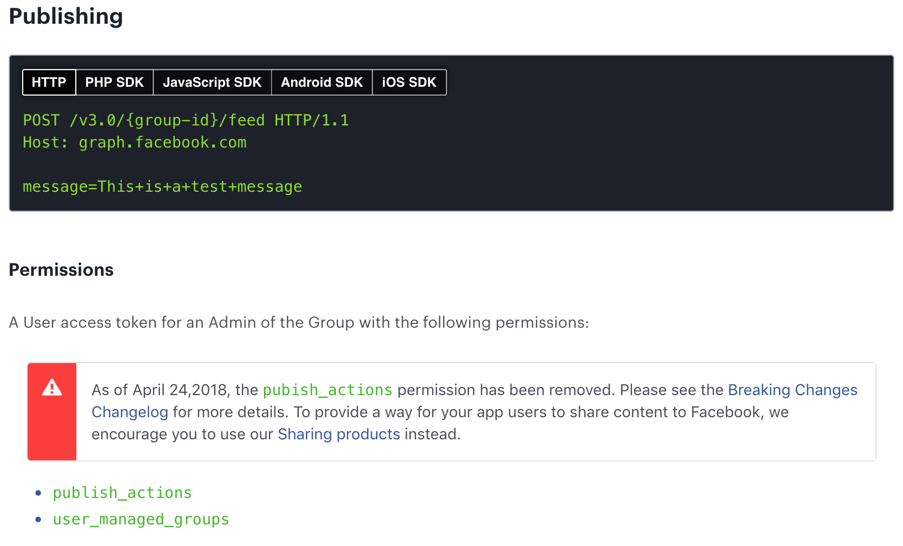

discourse-facebook-auto-publish
===

## Deprecated



## Notes

A specially developed daemon for publish discourse articles to the facebook group.


## Usage

- Install dependency

```console
$ npm insatll
```

- Start daemon
	- It has a pre-process to get the Facebook token.

```console
$ npm start
```

- Stop daemon

```console
$ npm stop
```


## Configuration

- need to copy `.env_sample` to `.env` and change it.

```javascript
DISCOURSE_URL=https://jsdev.kr
POLLING_INTERVAL_SEC=60
POSTED_AFTER_MIN=5
FACEBOOK_GROUP_URL=
FACEBOOK_USER=
FACEBOOK_PASS=
```

- `DISCOURSE_URL` should not end with `/`.


## Running on Docker or Container Service

```console
$ npm run start-docker
```


## To do

- Post to other facebook groups by category.
- Posting the same post to multiple groups.


## Caution

- Facebook can block or audit your account.


## License

MIT License
